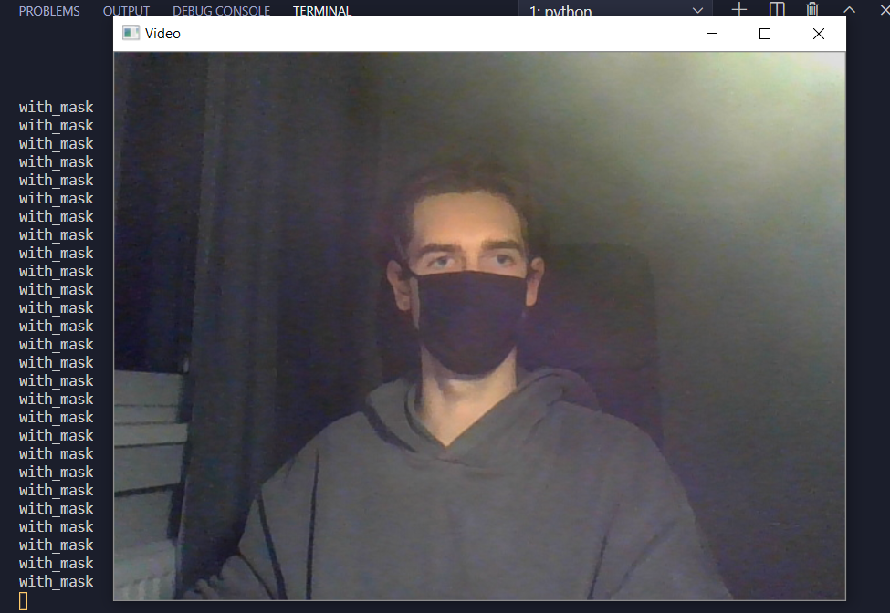
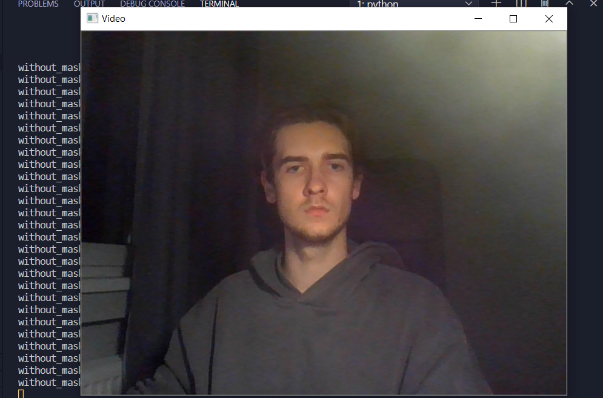

# face_mask_detection_machine_learning_app

 

## Description

 

Application detects if a test object is wearing a face mask correctly using Tensorflow, Keras, OpenCV. Also experimenting with PyTorch.

NOTE: Model parameters and layers were copied from Kaggle's website community Notebooks!!!
  

---

 

To run the application, firstly install necessary dependencies. 
You probably need to create a new virtual environment first.  

        python -m venv venv
        # On Windows
        .venv\Scripts\activate

 

        pip install opencv-python
        pip install tensorflow
        pip install keras

 
Now you are ready, start it with:
  

        python run_model.py

 

## Models

---

 

There are 3 models in the repository. Model2 has had the best results, since it was trained to only predict two classes **with mask and without mask**. First two models were also trained to predict if the mask is being **worn the correct way** and one of them used a different dataset but the models weren't very accurate. That's why model2 is currently the best one to use.

One of the dataset I used for this project: [Kaggle](https://www.kaggle.com/andrewmvd/face-mask-detection)

 

## Training

---

 

If you want to train your dataset, you need to run the following command:
  

        python train_model.py

 
But firstly you probably need to write your own read_dataset.py method.  I wrote two for two datasets that I have used read_dataset1 and read_dataset2.
  

## Testing

---
  

